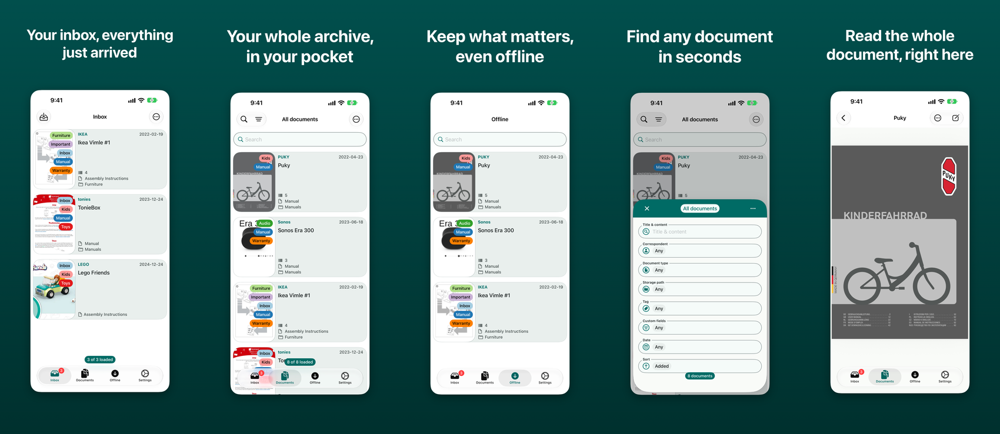

# Less Paper

A native iOS client for [paperless-ngx](https://github.com/paperless-ngx/paperless-ngx) — built in SwiftUI, on top of The Composable Architecture.

[](https://apps.apple.com/en/app/less-paper/id6464425056)
[](https://apps.apple.com/en/app/less-paper/id6464425056)
[](https://github.com/plu/less-paper/actions/workflows/ci.yml)
[](https://developer.apple.com/ios/)
[](https://swift.org)
[](https://github.com/pointfreeco/swift-composable-architecture)
[](https://tuist.dev)
[](LICENSE)
[](https://testflight.apple.com/join/3CM21m1n)



## Status

This is a complete rewrite of Less Paper, and it has not been released yet — what is on the App
Store today is still the old app. It supports paperless-ngx 3.0.0 and older versions.

A public beta is available on TestFlight: <https://testflight.apple.com/join/3CM21m1n>

## Features

- **Multiple servers** — connect to as many paperless-ngx instances as you like and switch between them
- **Search and filter** — the full filter set from the web UI, including custom-field filters
- **Saved views** — create, edit and reorder them from the app
- **Offline favorites** — keep chosen documents on the device, PDF and all, and read them with no server in reach
- **Document editing** — title, correspondent, document type, storage path, tags, notes and custom fields
- **Bulk edit** — apply changes to a whole selection at once, including bulk delete and merge
- **Import** — share sheet extension for getting documents in from anywhere on the device
- **Password-protected PDFs** — unlock on import, with passwords remembered in the keychain
- **Trash** — restore a document you deleted, or empty the trash for good
- **iPad layout** — the document opens in a second column beside the list, rather than pushing it aside
- **Single sign-on** — sign in with an OIDC provider your server offers, through a system browser sheet
- **Advanced authentication** — client certificates, custom HTTP headers, and reverse-proxy setups such as Authelia
- **Diagnostics** — a local error log, redacted of anything that could be a credential, that you can read and share when something goes wrong

## Requirements

- iOS 18.0 or newer
- A running [paperless-ngx](https://docs.paperless-ngx.com) instance to talk to

## Single sign-on (OIDC)

If your server offers [OpenID Connect sign-in](https://docs.paperless-ngx.com/advanced_usage/#openid-connect-and-social-authentication), the app shows the same providers on its sign-in screen and runs the login through a system browser sheet. For that flow to complete, the OAuth client your paperless instance uses needs two things on the identity provider:

- **`lesspaper://oidc-callback` registered as a redirect URI** — this is how the browser hands the login back to the app
- **a public (PKCE) code exchange allowed** — like any native client, the app exchanges its authorization code with PKCE and no client secret; a strictly confidential client will reject that exchange

If the browser sheet ends on an error from the provider about the redirect URI, the callback URL above is the thing that's missing.

## Building the app

Building requires Xcode 26.5; everything else is pinned with [mise](https://mise.jdx.dev), which installs Tuist, SwiftLint, SwiftFormat and everything else at the exact versions CI uses.

```sh
mise install       # tools + `brew bundle` via the postinstall hook
tuist install      # resolve Swift package dependencies
tuist generate     # generate LessPaper.xcworkspace
```

### A local paperless-ngx to develop against

```sh
mise run docker:start   # bring up paperless-ngx
mise run docker:seed    # fill it with realistic fixture data
mise run docker:stop
```

### Everyday tasks

```sh
mise run ci:test:unit    # run the unit tests
mise run ci:test:ui      # run the XCUITest journeys (slow)
mise run ci:lint         # SwiftLint + SwiftFormat
mise run format          # apply formatting
mise run snapshots:diff  # visual diff of changed snapshots
mise run screenshots:frame  # re-render the App Store screenshots
```

## Architecture

The project is generated by [Tuist](https://tuist.dev) from `Project.swift`, and split into modules declared in `Tuist/ProjectDescriptionHelpers/Module.swift`:

- **Interface / implementation** — `ApiInterface` holds the models and use-case protocols; `ApiImplementation` holds the concrete networking. Features depend only on the interface, which is what keeps them testable.
- **Feature modules** — one per domain (`DocumentsFeature`, `TagsFeature`, `CustomFieldsFeature`, …), each a [TCA](https://github.com/pointfreeco/swift-composable-architecture) reducer plus its SwiftUI views.
- **App modules** — `ShareApp` alone, which stands in for the share extension so XCUITest can drive it without going through another app's share sheet. The per-feature harness apps this list once described are gone: UI tests drive the real app now — see [Testing](#testing).
- **Support modules** — `Components` for shared UI, `TestSupport` / `ApiTestSupport` / `UITestSupport` for the test helpers, and `MarketingKit`, which renders the App Store screenshots from committed captures.

Dependency injection runs through [swift-dependencies](https://github.com/pointfreeco/swift-dependencies), persistence through [swift-sharing](https://github.com/pointfreeco/swift-sharing), and networking through [Get](https://github.com/kean/Get).

## Testing

Tests are written with [Swift Testing](https://developer.apple.com/documentation/testing) and cover unit tests and [snapshot tests](https://github.com/pointfreeco/swift-snapshot-testing), plus XCUITest journeys that drive the real app.

The API layer is tested against a live paperless-ngx container rather than mocks, so the tests catch real API drift.

UI tests live in `AppUITests` and drive the assembled app end to end — onboarding, server management, settings, the create/edit/delete lifecycle of each entity, custom fields, and document browsing and editing — rather than a harness app per feature. Each test creates its own paperless user, so what it makes is invisible to every other test and the lists it opens start empty. The journeys run serially and take several minutes; they are the slow part of the suite, so CI reserves them for `main` and for pull requests labelled `UITests` or `TestFlight`.

## Contributing

Conventions for this codebase — comment style, TCA patterns, the confirmation-popup rule and more — live in [AGENTS.md](AGENTS.md). Please read it before opening a pull request. Releasing to the App Store is a maintainer task, documented in [docs/releasing.md](docs/releasing.md).

## License

[MIT](LICENSE) © Johannes Plunien
